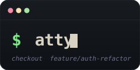

<h3 align="center">
	
</h3>

<p align="center">
	<a href="https://github.com/fentas/atty/stargazers">
		</a>
	<a href="https://github.com/fentas/atty/releases/latest">
		</a>
	<a href="https://github.com/fentas/atty/actions/workflows/ci.yml">
		</a>
	<a href="https://atty.sh">
		</a>
	<a href="https://ziglang.org/">
		</a>
</p>

&nbsp;

<p align="left">

`atty` is a **Suckless-style PTY proxy** in Zig. It sits between your terminal emulator (Ghostty, Alacritty, kitty…) and your shell, and composes its middleware **at compile time** instead of loading plugins at runtime. Edit `src/config.zig`, recompile — that is the entire configuration model.

Features:

- **Comptime module dispatch** — `inline for` over your config tuple; disabled modules contribute *zero bytes* to the binary
- **Atuin autosuggestions** — fish-style dim/italic ghost text from your shell history, via an async worker thread
- **Dangerous-command guardrail** — swallows Enter on `rm -rf /`, `dd if=…`, `… | sh`, fork bombs, and friends, then waits for a confirm
- **Optional comptime hooks**: `attach` / `detach` / `onInput` / `onOutput` / `onTick` / `onLineCommit` / `onResize` / `provideGhostText` / `provideGhostList` / `provideErrorText` / `provideTermBytes` / `statusText` / `isOverlayActive` / `deleteHistoryMatch` — implement what you need, the rest is statically dropped
- **Single static binary** — musl-linked, no libutil, no runtime deps; `ghcr.io/fentas/atty:latest` is ~14 MB
- **Zero-allocation hot path** — per-keystroke dispatch does no heap traffic; Atuin lookups happen on a worker thread

</p>

&nbsp;

#### Disclaimer

An LLM primarily generated this code and has not yet been fully reviewed or tested by a human maintainer. It may contain bugs, security issues, or non-idiomatic patterns.

&nbsp;

### 🐚 What it looks like

```text
$ git checkout featu re/auth-refactor                     ← dim italic ghost text
                    ^^^^^^^^^^^^^^^^^

$ rm -rf /home/work/
! atty guardrail: rm -rf invocation [user]
        line: rm -rf /home/work/
        press Enter again to confirm, any other key to cancel.
```

A live, animated demo lives on [atty.sh](https://atty.sh).

&nbsp;

### 🚀 Install

Two installers, two philosophies. Pick one.

```bash
# 🛠  The Suckless way — get the source, edit src/config.zig, compile.
#    Bootstraps Zig if you don't have it. Prompts before opening config.
curl -fsSL https://get.atty.sh | sh

# 📦 Just give me the binary — no toolchain, no source, default modules.
#    Resolves arch, verifies sha256, chmods, hints at $PATH.
curl -fsSL https://bin.atty.sh | sh
```

Either one installs to `~/.local/bin/atty` by default. Both honor
`INSTALL_DIR=…`. The binary installer additionally honors
`ATTY_VERSION=…`; the source installer honors `ATTY_SRC=…`,
`ATTY_NONINTERACTIVE=1`, and `REPO_URL=…`.

The two installers above ship the **proxy only**. If you want the full
supply-chain protection — the `atty-guard` Rust daemon with eBPF LSM
hooks, the threat-classification pipeline, and scheduled atom-corpus
updates — clone the repo and run:

```bash
sudo make install GUARD_FEATURES=tier2-onnx,osv-live,atoms-fetch,ebpf
```

Sets up the `atty:atty` system user, installs the systemd unit, drops
in the eBPF override, starts the daemon. Then `sudo usermod -aG atty
$USER` + a new shell. See [getting-started/#full-install](https://atty.sh/getting-started/#full-install-atty--daemon--ebpf--atoms)
for the breakdown of each feature flag and [operator-workflow](https://atty.sh/operator-workflow/) for verification + atom corpus management.

For container use:

```bash
docker pull ghcr.io/fentas/atty:latest
```

Supported pre-built targets: `linux-x86_64`, `linux-aarch64`
(musl-static). The source flow works anywhere Zig 0.16 does.

Then make it your terminal's startup command. Ghostty
(`~/.config/ghostty/config`):

```
# Ghostty starts atty, which then starts your shell.
command = atty bash
```

Pin the shell explicitly (`atty bash`/`atty zsh`/…) in your terminal
config rather than relying on `$SHELL` — when the terminal is what
spawns atty, the environment is minimal and `$SHELL` may not yet be
set. Inside the shell that atty spawns, your `.bashrc`/`.zshrc` will
of course see `$SHELL` normally.

Or invoke ad-hoc:

```bash
atty                       # spawn $SHELL through the proxy
atty bash                  # spawn bash explicitly
atty bash -l               # bash with -l
atty zsh -c 'echo hi'      # zsh -c 'echo hi'
```

The first non-flag positional is the shell binary; everything after it
is passed to that shell verbatim — same convention as `env(1)` or
`sudo(1)`. Use `--` only if your shell's name starts with a dash.

#### Detecting atty from your shell

atty injects three env vars into every spawned shell. Use them in your
`.bashrc`/`.zshrc` to avoid double-wrapping:

```bash
# Only run atty if we aren't already inside an atty session,
# and only if the binary is actually on PATH (so a missing install
# never locks you out of your shell).
if [[ -z "${ATTY}" ]] && command -v atty >/dev/null; then
    exec atty bash
fi
```

| Variable       | Value                                |
|----------------|--------------------------------------|
| `ATTY`         | `1`                                  |
| `ATTY_PID`     | pid of the atty proxy (parent)       |
| `ATTY_VERSION` | semver string (e.g. `0.1.0`)         |

The `command -v` guard is a footgun saver: if atty disappears (uninstall,
upgrade gone wrong, fresh machine), your shell still starts normally
instead of bailing on `exec` failure.

&nbsp;

### 🛠 Configure

`atty` has no runtime config file. dwm-style two-file split:

- [`src/config.def.zig`](src/config.def.zig) — committed template with commented examples (atty maintains).
- **`src/config.zig`** — your file. Gitignored. `build.zig` copies the template across on first build.
- [`src/defaults.zig`](src/defaults.zig) — atty-shipped value for every knob.

Edit `src/config.zig`. Recompile. Your edits never conflict on `git pull` because the file isn't tracked, and your config only contains what you override — every other knob falls through to `defaults.zig`, so new tunables added upstream just appear.

```zig
const atty = @import("atty");

// Pick your modules. Default = { guardrail, history } — dependency-free.
pub const modules = .{
    atty.modules.guardrail.configure(.{}),
    atty.modules.atuin.configure(.{
        .suggestion_ttl_ms  = 0,          // 0 = fish-style (no fade)
        .sync_after_records = 10,
    }),
    atty.modules.history.configure(.{}),  // shell-native fallback
};

// Override the visual style if you don't want the dim-only default.
pub const ghost: atty.Ghost = .{ .style = atty.style.presets.muted_italic };

// Override the accept keys if Right / End / Ctrl+F isn't what you want.
pub const keymap: atty.Keymap = .{
    .bindings = &.{
        .{ .bytes = atty.keymap.key("Tab"), .action = .ghost_accept },
    },
};
```

Every subsystem (`proxy`, `ghost`, `terminal`, `keymap`, `statusbar`) is a struct with per-field defaults — your `pub const xxx: atty.Xxx = .{ … }` only spells out the fields you want different. Anything you don't declare picks up `defaults.zig`.

To track a config outside the repo:

```bash
make CONFIG=/path/to/mine.zig build
# or
zig build -Dconfig=/path/to/mine.zig
```

&nbsp;

### ✍️ Writing a module

A module is a Zig type — typically returned from `configure(comptime cfg) type` — with some subset of these decls:

| Hook                 | Called when                                | Hot path |
|----------------------|--------------------------------------------|----------|
| `attach(allocator)`  | once at startup                            | no       |
| `detach(rt)`         | once at shutdown                           | no       |
| `onInput`            | every keystroke from the user              | **yes**  |
| `onOutput`           | every chunk from the shell                 | **yes**  |
| `onLineCommit`       | Enter pressed on a non-empty, certain line | no       |
| `provideGhostText`   | when atty wants to render an overlay       | yes      |
| `onTick`             | on poll() timeout (default 100 ms)         | no       |

Minimal example — uppercase every keystroke:

```zig
pub fn configure(comptime _: Config) type {
    return struct {
        pub const Runtime = struct { buf: [256]u8 = undefined };
        pub fn attach(_: std.mem.Allocator) !Runtime { return .{}; }
        pub fn detach(_: *Runtime) void {}
        pub fn onInput(rt: *Runtime, _: *m.Context, in: []const u8) m.Error!m.Action {
            for (in, 0..) |b, i| rt.buf[i] = std.ascii.toUpper(b);
            return .{ .replace = rt.buf[0..in.len] };
        }
    };
}
```

Full walkthrough: [docs/modules.md](docs/modules.md) or [atty.sh/modules](https://atty.sh/modules/).

&nbsp;

### 🐳 Using Docker

```bash
# Run atty inside a container
docker run --rm -it ghcr.io/fentas/atty:latest

# Copy the binary out of the image
docker create --name atty-tmp ghcr.io/fentas/atty:latest && \
  docker cp atty-tmp:/usr/local/bin/atty ./atty && \
  docker rm atty-tmp
```

Or use it as a base layer in your own image:

```dockerfile
FROM alpine:3.20
COPY --from=ghcr.io/fentas/atty:latest /usr/local/bin/atty /usr/local/bin/atty
ENTRYPOINT ["atty"]
```

The image is multi-arch (`linux/amd64`, `linux/arm64`) and the binary is musl-static.

&nbsp;

### 📦 Built-in modules

| Module                                                       | Hook surface                                                         | Purpose                                                                |
|--------------------------------------------------------------|----------------------------------------------------------------------|------------------------------------------------------------------------|
| [`guardrail`](src/modules/guardrail.zig)                     | `onInput`                                                            | Confirm-on-Enter for `rm -rf /`, `dd`, `mkfs`, fork bombs, curl-pipe-sh |
| [`history`](src/modules/history.zig) *(default)*             | `onInput`, `onLineCommit`, `onTick`, `provideGhostText`, `provideGhostList`, `deleteHistoryMatch` | Shell-native suggestions from `~/.bash_history` / `~/.zsh_history`     |
| [`atuin`](src/modules/atuin.zig) *(opt-in)*                  | `onInput`, `onLineCommit`, `onTick`, `provideGhostText`, `provideGhostList`, `statusText`, `deleteHistoryMatch` | Fish-style autosuggestions from your Atuin history + record on Enter   |
| [`security_guard`](src/modules/security_guard/)              | `onInput`, `onAction`, `onTick`, `statusText`                        | Pre-Enter Tier-1 classifier + UDS client to the `atty-guard` sidecar; `Alt+Shift+W` dumps warn buffer |
| [`mouse_links`](src/modules/mouse_links.zig) *(opt-in)*      | `onOutput`, `onMouseClick`, `pollShellInput`                         | Left-click a path token in output → `$EDITOR +LINE 'path'` injected into the shell |
| [`mouse_urls`](src/modules/mouse_urls.zig) *(opt-in)*        | `onOutput`, `onMouseClick`, `onInput`, `provideHintText`, `statusText` | Left-click a URL → `xdg-open`; `whitelist_only` / `never` / `ask_each` trust modes |
| [`llm`](src/modules/llm/)                                    | `onInput`, `onLineCommit`, `onResize`, `provideGhostText`, `provideGhostList`, `provideErrorText`, `statusText`, `isOverlayActive` | `#: intent` → shell-command rewrite; Alt+A single, Alt+S dialog, Alt+R recall |

Add your own under `src/modules/` and wire it into `config.modules`. Reference docs: [atty.sh/modules](https://atty.sh/modules/).

&nbsp;

### 🧪 Build from source

```bash
mise use zig@0.16.0           # any other Zig 0.16.0 install also works
zig build                     # → ./zig-out/bin/atty
zig build test --summary all  # 1112 unit tests
zig build itest --summary all # PTY round-trip integration test
```

Or via Make:

```bash
make build         # ReleaseSafe
make test itest
make install       # → ~/.local/bin/atty
make docker        # local image
make docker-binary # build in docker, copy binary to ./dist/atty
```

`make help` lists every target.

&nbsp;

### 🎯 Roadmap

- [x] ~~OSC 133 prompt-marker awareness (drop guesswork from the line-state model)~~ — shipped in `src/osc133.zig`; auto-detects when shells emit `\x1b]133;A\x07` / `;B\x07` / `;C\x07` / `;D[;<code>]\x07` (BEL- or ST-terminated) and overrides the keystroke-tracker's view of the typed input.
- [ ] Atuin daemon socket backend (replace the subprocess fallback once IPC stabilises)
- [ ] Bracketed-paste detection (suppress ghost text during a paste burst)
- [ ] Ring buffer for `onOutput` parsers that span read boundaries
- [ ] BSD / macOS support (currently Linux-only; PTY dance needs `ioctl(TIOCPTYGRANT)` glue on Darwin)

&nbsp;

### 🤝 Contributing

PRs welcome. The flow is **feat/fix conventional-commit PR → release-please opens a release PR → merging the release PR cuts a tag and ships binaries**. Details and PR-title rules in [CONTRIBUTING.md](CONTRIBUTING.md).

Before pushing: `make fmt && make test`.

&nbsp;

### 📜 License

[MIT](LICENSE). Use it, ship it, fork it, sell it — keep the copyright notice intact.

&nbsp;

### ❤️ Gratitude

- [Atuin](https://github.com/atuinsh/atuin) — the history daemon this proxies for.
- [Suckless](https://suckless.org) — for the *config.h, recompile, ship* aesthetic this whole project apes.
- [Ghostty](https://ghostty.org), [Alacritty](https://alacritty.org), [kitty](https://sw.kovidgoyal.net/kitty/) — the terminal emulators atty plays in front of.
- [Zig](https://ziglang.org) — for making `inline for` + `@hasDecl` a viable plugin model.
- Inspiration on the README treatment and conventional-commit release flow lifted from [fentas/b](https://github.com/fentas/b).

&nbsp;

<p align="center">Copyright &copy; 2026-present <a href="https://github.com/fentas" target="_blank">fentas</a></p>
<p align="center"><a href="https://atty.sh"></a></p>
